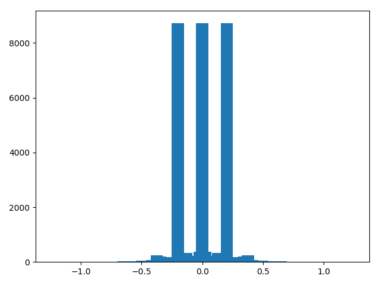
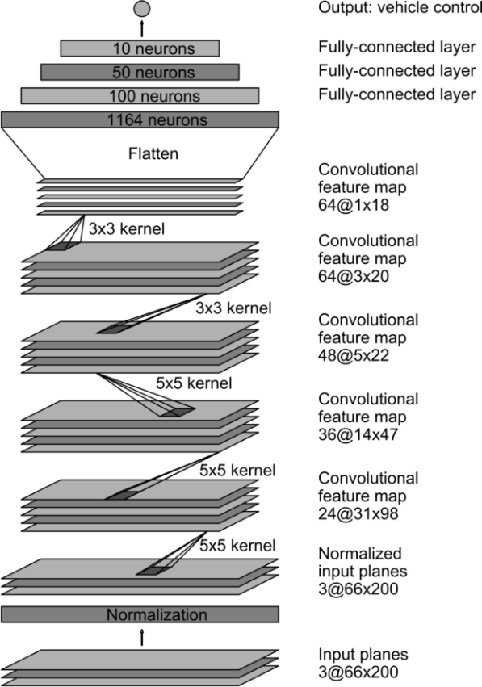

# Behaviour Clonning

# Introduction

Eight laps of track 1 (4 in each direction) were used as initial training data.

More data was generated using Data.py. It does the following things to generate data:

1. It takes as input, images from all three cameras.
2. For images from the left camera, a correction of 0.2 is added to the measurements
3. For images from the right camera, a correction of 0.2 is subtracted from the measurements
4. All images are horizontally flipped, and their measurements are also reversed. This is done to help the model generalise better.
5. The Data.py stores these images into a Numpy array.

 
 
 

# Architecture

I have used the Nvidia&#39;s CNN architecture. For this the following operations were performed

1. Cropping the top and bottom of image
2. Resize to 66 by 200 pixels
3. Normalise between -.5 and .5
4. 5 layers of convolution
5. 3 fully connected layers
6. Dropout with keep\_prob = 0.75 in first fully connected layer

I also used LeNet, but, no amount of training and tweaking could get it to steer the car successfully about the last corner.

Initially, learning parameter is 0.0001. For fine tuning, the learning rate is set at 0.00001.

 

I was unable to generate good data on my hardware, hence I ended up using Udacity&#39;s dataset
